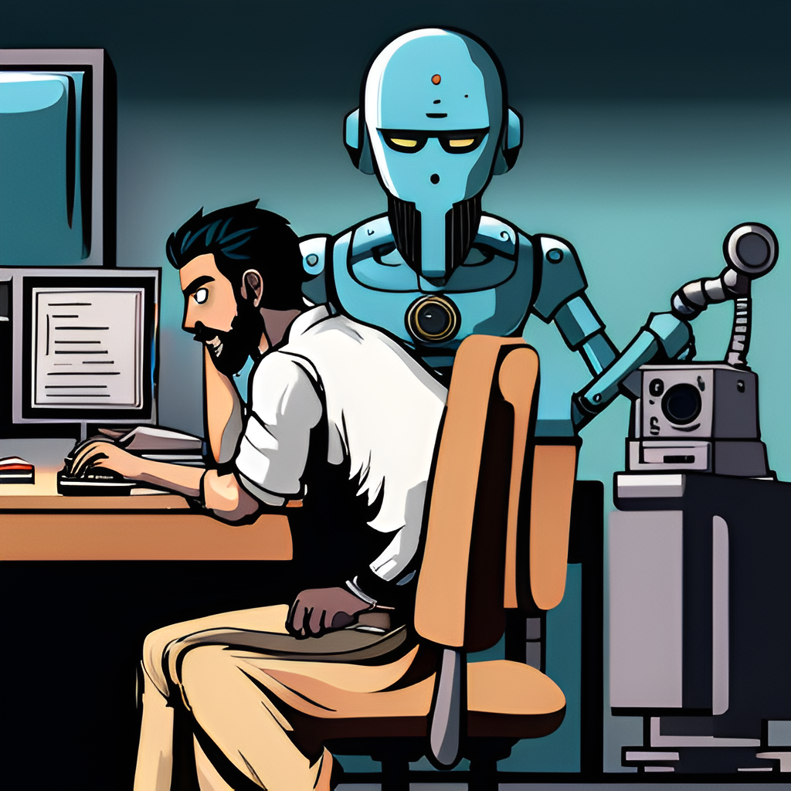

# My Early Experiments with LLMs

## Introduction

Once upon a time, I was just a curious person working with machine learning and Natural Language Processing (NLP) at a company called Apixio. Back then, I learned about these things called language models. One day, I stumbled upon this awesome paper 'Language Models are Zero Shot Learners.' Man, it blew my mind! But guess what? I got too tied up leading a team and couldn't explore it further.

Then, GPT-4 entered the scene. Wow, it was like seeing magic! It felt like I had just stepped into the future. Right then, I knew I had to get on this language model train. So I dived right in, playing around with ChatGPT, Bard from Google, and other super cool Language Learning Models (LLMs).

I wasn't just messing around with these tools, though. I had a plan. I wanted them to help me with coding and even building my own language models. You know, really get to grips with the nuts and bolts of the thing. But, there was more. I saw these LLMs as an untapped gold mine that could change how we do things in many fields.

Take healthcare, for example. You've got doctors dictating patient notes that an LLM could write up. Or an LLM could help sort through heaps of medical records. Even cooler? An LLM could aid in diagnosis by sifting through symptoms and patient history. But that's not all.

Imagine Hierarchical Condition Category (HCC) coding, a crucial process in Medicare Advantage that affects patient risk, payment, and care coordination. Right now, it's an expensive process with nurses gaming the system at computers when they could be providing care to patients. I reckon LLMs could revolutionize this by identifying valid codes along with supporting documentation straight from physician notes. That's the kind of future I see, and I'm stoked to be a part of it.

## Using LLMs for Coding and Article Writing

Let me take you back to when I first used LLMs for my coding tasks. It started with something as simple as date parsing in Python and JavaScript. Seeing the tool shine, I decided to up the stakes. I remember this one time where I enlisted ChatGPT's help to code a parser for graphs expressed as Mermaid. You know what? It did a decent job. However, as time passed, I found that Bard was actually the go-to LLM for my coding needs. It was like my personal assistant, helping me write React components in TypeScript. There was even this one time I wrote an entire editable table component by just feeding requirements to Bard. Isn't that cool? And just recently, I tackled a web RTC related React component with the help of my trusty sidekick, Bard.

But coding isn't the only area where LLMs have been a big help. I have a confession to make. English isn't my first language; I grew up speaking Tamil. So, writing articles in English? Yeah, not my favorite thing. But then along came ChatGPT. Now, I just have to mention the points I want to make, the audience I'm talking to, and any style preferences. Voila! ChatGPT handles all the phrasing for me. It's like having your own personal wordsmith. Sure, it might have made me a lazy writer, but I prefer to think of it as leveling the playing field for non-native English speakers like me.

Now, I'm not saying these LLMs are perfect. Trust me, they have their quirks. For instance, they aren't great at writing long-form articles. Sometimes, they lose track of the original point I was trying to make and I find myself having to remind them. And, while this may sound odd, ChatGPT sometimes writes like it's an early 20th-century author instead of a modern technical blogger. I mean, I appreciate the eloquence, but sometimes you just need to get to the point, right? That's where Bard shines. It's straightforward and direct, just how I like it.

## ChatGPT: A Reactive Tool

So, let's talk about how I work with ChatGPT. You know how it is when you ask someone to do something and they do it, but don't take it any further? That's kind of how ChatGPT feels. It's what I call 'reactive'. It responds to my prompts, but doesn't usually go the extra mile to help me achieve a task. I'm pretty sure it's because of the way it's been trained.

But here's the thing, despite this, it's been a game-changer for me. It helps me write at the speed of thought, which for a non-native English speaker, is nothing short of amazing. But I'm not settling for just 'amazing'. I want ChatGPT to be proactive. You know, like when you tell a mate your goal and they don't just nod along – they ask questions, give suggestions, really get involved. Imagine if ChatGPT could do that!

Sure, some people say plugins are the solution, but honestly, the only one I've found useful so far is the Wolfram Alpha plugin. The rest? Not so much. Take this one time I was writing a guest article for a newsletter. I had to do all the heavy lifting – structuring the article, deciding what to write, how to flesh it out – while ChatGPT basically summarized relevant research and rephrased stuff for me.

Now, don't get me wrong, that's super helpful. But I can't help but dream about what it'd be like if ChatGPT could have been more, well, proactive. This, in my opinion, is a bit of a shortcoming with LLMs right now. They're great, but there's room for improvement. With a little less hand-holding and a little more initiative, they could be, well, extraordinary.

## ChatGPT vs Bard: A Face-Off

So, you're probably wondering, how does ChatGPT stack up against Bard, right? Well, let's dive into that. First off, the writing style. Bard's got this less formal vibe going on, which is more my style. ChatGPT? Sometimes, it can come off a little stuffy, like it's channeling some old-timey English professor. Not bad, but not always my cup of tea.

Now, when it comes to coding tasks, I've gotta give it to Bard. I know, I know, I originally thought GPT was the winner here, and it's pretty good at banging out specific functions. But when it comes to writing a whole class from scratch, based on some requirements? Bard takes the cake.

And you know what else Bard's good at? Finding obscure references. Could be that it's because of the freshness of its training data or maybe Google's just got a knack for choosing better data. Either way, Bard's got an edge there.

But let's not get carried away. ChatGPT's got its strong points too. It's a pro at rephrasing and summarizing tasks. And when it comes to reasoning tasks, ChatGPT's in a league of its own. Like this one time, I was helping my girlfriend write a script for a project. I gave GPT a general outline, and with a bit of prompting, it produced a script that was exactly what I wanted. Bard, on the other hand, lost track of the context and started including scenes I'd specifically told it to avoid. And if you ever need to quickly summarize an article? GPT's your go-to.

## Closing Thoughts: The Future of LLMs

Alright folks, let's put a bow on this. My journey with Language Learning Models like ChatGPT and Bard has been a wild ride. They've got their quirks, their pros and cons, but overall, they're a force to reckon with.

Whether it's coding, drafting articles, or even just rephrasing something to make it shine, these AI models have been game changers. Yes, they've got their limitations, and they're not about to replace us humans anytime soon. But they sure can make our lives a whole lot easier, don't you think?

But let's zoom out for a second, because the true potential of these technologies is far bigger than me writing code or articles. Imagine a world where anyone, regardless of their native language, can participate fully in global conversations. That's a game changer, right? Well, with tools like these, we're getting closer to making that a reality.

And let's not forget about the transformative impact on healthcare. By streamlining a bunch of clinical workflows, these tools can free up medical professionals to focus on what they do best: caring for patients. 

So here's to the future of AI, where our silicon sidekicks don't just react to our commands but understand our goals and help us achieve them. Where they're not just tools, but partners. It's a future I'm excited to be a part of. Who's with me?
