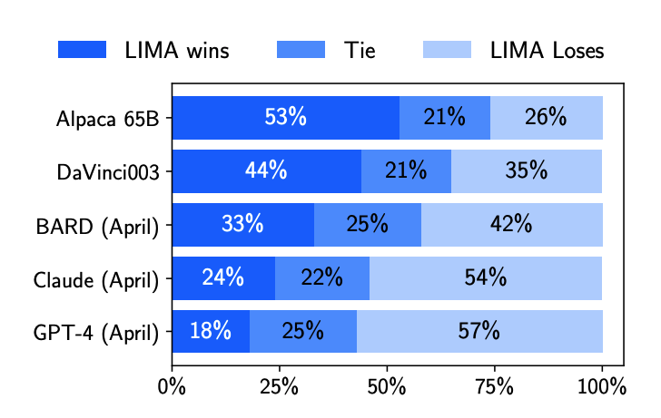

# Less is More: A Deep Dive into the LIMA Paper and Its Impact on AI Models

## Introduction

In the fast-paced world of artificial intelligence (AI), new and promising research pops up all the time. A recent study that drew my attention is [LIMA: Less Is More for Alignment](https://arxiv.org/pdf/2305.11206.pdf) authored by a team of AI researchers at MetaAI. While it hasn't yet achieved widespread recognition, the paper's potential implications for AI training underscore its significance.

The LIMA paper introduces the "Superficial Alignment Hypothesis." This innovative proposition suggests that the lion's share of an AI model's knowledge is derived from its pre-training phase, with the alignment or fine-tuning process primarily guiding the model towards specific goals.

However, the LIMA approach distinguishes itself by its fine-tuning method. Eschewing traditional reinforcement learning methods for alignment, it advocates for the use of supervised learning with a meticulously hand-curated set of prompts and responses. These data are sourced from reputable and diverse platforms, including Stack Exchange, wikiHow, and scientific papers.

Employing this approach, the researchers managed to challenge GPT-3.5, one of the most powerful AI models presently in use. The results suggest it is possible to train competitive LLMs that could have far-reaching benefits for both open source models and enterprise applications.

In this article, I will delve into the Superficial Alignment Hypothesis, examine the supporting evidence, and explore its potential impacts. My focus will particularly be on healthcare, a sector where the issues of data privacy and specificity present unique challenges.

## The Superficial Alignment Hypothesis

The Superficial Alignment Hypothesis, introduced by the LIMA paper, suggests a new approach to training AI models. According to this hypothesis, the pre-training phase is where the model acquires most of its knowledge, while the alignment or fine-tuning phase serves to guide the model's outputs towards specific goals.

In simpler terms, pre-training is where the model gets its general education about the world. The alignment phase then acts as specialized training, teaching the model how to apply its knowledge to specific tasks.

The researchers at MetaAI put it this way: 
> A model’s knowledge and capabilities are learnt almost entirely during pretraining, while alignment teaches it which subdistribution of formats should be used when interacting with users. 

If this hypothesis holds true, it implies that a pretrained language model could be sufficiently tuned with a relatively small set of examples. This shift in focus opens up new possibilities for AI training methods.

## Outperforming GPT-3.5

The LIMA paper presents a compelling experiment as proof of the Superficial Alignment Hypothesis. The researchers took a 65 billion-parameter model, LLAMA, and fine-tuned it using just a thousand carefully selected prompts and responses. This process yielded results that were nothing short of impressive.

Despite the small set of examples used for fine-tuning, LIMA demonstrated outstanding performance. It learned to generate specific response formats from a scant number of examples, dealing with complex queries that ranged from planning trip itineraries to speculating about alternate history scenarios. Notably, LIMA showed a strong capacity to generalize well to tasks that were not included in the training data.

However, the most significant validation came from a controlled human study. Here, LIMA's responses were found to be equivalent or superior to GPT-4 in 43% of cases. This preference rose to 58% when compared with Bard, and reached an impressive 65% against DaVinci003, a model trained with human feedback and considered equivalent to GPT-3.5.

Furthermore, an analysis of LIMA responses on an absolute scale revealed that 88% of them met the prompt requirements, and 50% were considered excellent. This demonstrates the model's capability to consistently produce high-quality outputs.

These findings strongly support the Superficial Alignment Hypothesis, suggesting that most knowledge in large language models is derived during pre-training, with only a limited set of instruction data necessary for fine-tuning. The results point to a new direction for AI training, with LIMA achieving competitive or even superior results to GPT-3.5 with a much smaller set of examples for alignment​.

## Implications for Open Source Models and Enterprises

The LIMA findings bring transformative potential for open source models like StabilityLM or MPT-7B. Enterprises can now leverage these models, fine-tuning them with proprietary data without sharing it with third parties. This boosts the role of open source LLMs in the industry.

Enterprises can now build customized LLMs without data sharing with major players like OpenAI or Google. This could prompt cloud providers like Amazon AWS and IBM to offer turnkey solutions for in-network model operationalization.

The benefits are primarily in risk mitigation and regulatory compliance, as in-house data use during fine-tuning reduces data leakage risk and enhances privacy regulation adherence.

For enterprises working with structured and semi-structured data or aiming to structure unstructured data, the LIMA findings are particularly potent. The concept that fine-tuning involves selecting subdistributions on the knowledge learned by the LLM means enterprises can create customized information extraction models atop an existing open source LLM.

In summary, LIMA's findings accelerate LLM adoption within enterprises, reducing data leakage and regulatory concerns and thereby fast-tracking AI integration within enterprise workflows and processes.

## Potential in Healthcare

Sensitive patient data is a hallmark of healthcare, creating unique AI implementation challenges. Strict compliance with regulations like the HIPAA and HITECH acts in the US severely restricts patient data sharing with third parties, including AI powerhouses like Google and OpenAI. This has hindered healthcare organizations from fully embracing the productivity boosts that AI offers.

However, the LIMA paper's findings offer a promising solution. By starting with readily available open source models, healthcare entities can create LLM-based applications, fine-tuning them on their sensitive data. This can be done internally, eliminating patient data leakage risks.

The impact on healthcare workflows could be substantial. Consider the prior authorizations process, a time-consuming task requiring justification for a patient's procedure or drug. An LLM fine-tuned for healthcare on patient data could automate this process, freeing healthcare providers to focus more on patient care. The fine-tuning can be specialty-specific, enabling individual clinics to run their own edge models.

Another immediate application is in medical coding. LLMs can extract relevant information from progress notes to provide the most suitable codes instantly. Moreover, in combination with a speech-to-text model, an ambient documentation system could be developed. This system could record conversations between physicians and patients, transcribe them, rephrase as SOAP notes, and potentially structure as FHIR documents for interoperability, all in real-time. This application could significantly alleviate the administrative burden that currently weighs heavily on healthcare organizations, driving down costs and enhancing efficiency.

In summary, the LIMA paper's findings unlock a host of possibilities for the healthcare sector, facilitating AI models' deployment that respects patient privacy and proprietary data, ultimately enhancing healthcare workflows.

## Conclusion

The LIMA paper's findings could fundamentally shift how we approach AI development, placing a spotlight on the value and viability of open source models in the enterprise sector. Fine-tuning using a small set of hand-curated examples not only mitigates the risk of proprietary information leakage but also enables organizations to enjoy the productivity enhancements that AI can offer.

For the broader AI field, these findings underscore the need for further support of open source efforts in building larger LLMs beyond the 65B range currently available. These advancements could democratize AI capabilities, allowing more organizations to leverage this powerful technology.

High-cost, highly-regulated environments like healthcare stand to benefit immensely from this approach. The ability to fine-tune existing open-source LLMs could unlock efficiencies across the board, from automating administrative tasks to structuring unstructured patient data.

Moreover, cloud providers, especially those without their own LLMs, like IBM and Oracle, should pay close attention. By offering turnkey solutions that leverage LLMs, they can provide a valuable service to enterprises looking to operationalize these models within their networks.

In conclusion, the LIMA paper's findings present an exciting opportunity to reshape the AI landscape. As we continue to explore the implications, the potential to enhance productivity, protect proprietary data, and democratize AI capabilities is clear. The future of AI development lies not only in building larger models but also in refining how we align and fine-tune them, and that future begins now.